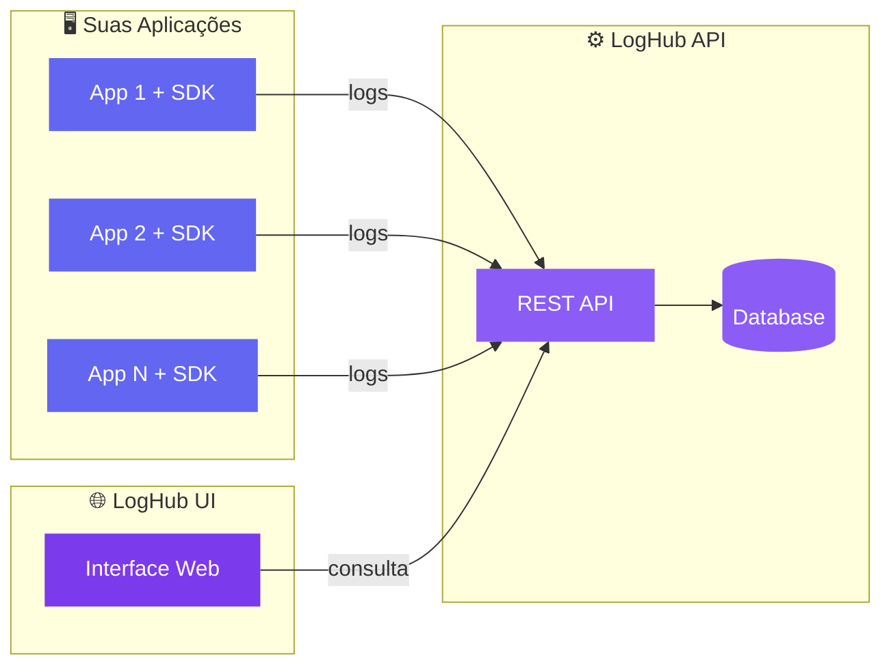

# LogHub Open

**Plataforma open source para coleta, centralização e análise de logs**

---

## O que é a LogHub Open?

A **LogHub Open** é uma organização focada em ferramentas open source para **observabilidade e gerenciamento de logs**. Nosso objetivo é fornecer soluções acessíveis, escaláveis e fáceis de integrar para times de desenvolvimento e operações.

## 🌐 Projetos

| Repositório | Descrição | Stack |
|-------------|-----------|-------|
| [**loghub-sdk**](https://github.com/LogHub-Open/loghub-sdk) &nbsp;&nbsp;&nbsp; | SDK Java para logging estruturado, com envio assíncrono para a LogHub API | Java 17, Maven, Logback |
| [**loghub-api**](https://github.com/LogHub-Open/loghub-api) &nbsp;&nbsp;&nbsp; | Backend RESTful para ingestão, armazenamento e consulta de logs | Java 17, Spring Boot, PostgreSQL |
| [**loghub-ui**](https://github.com/LogHub-Open/loghub-ui) &nbsp;&nbsp;&nbsp; | Interface web para visualização, filtro e diagnóstico de logs | React 19, TypeScript, Vite, Tailwind |

Os badges de issues, PRs e último commit são dinâmicos (via shields.io) — atualizam sozinhos conforme os repositórios mudam.

### Arquitetura

Suas aplicações usam o **loghub-sdk** para enviar logs estruturados via HTTP para a **loghub-api**, que os armazena e indexa. Você visualiza e analisa os dados através da **loghub-ui**.

## 🤝 Contribuindo

Adoramos contribuições! Seja reportando bugs, sugerindo funcionalidades ou enviando PRs.

1. Leia nosso [Guia de Contribuição](https://github.com/LogHub-Open/.github/blob/main/CONTRIBUTING.md)
2. Confira nosso [Código de Conduta](https://github.com/LogHub-Open/.github/blob/main/CODE_OF_CONDUCT.md)
3. Abra uma issue ou PR no repositório desejado

## 💬 Comunidade

- Encontrou um bug? Abra uma **issue** no repositório correspondente.
- Tem uma ideia? Use as **Discussions** do projeto.
- Questões de segurança? Veja nossa [Política de Segurança](https://github.com/LogHub-Open/.github/blob/main/SECURITY.md).

---

  Feito com ❤️ pela comunidade LogHub Open

